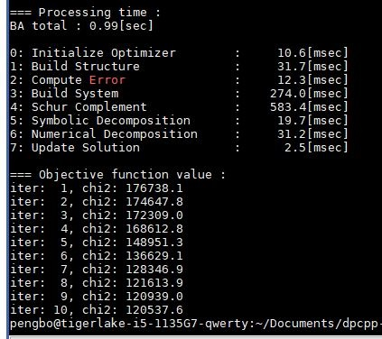
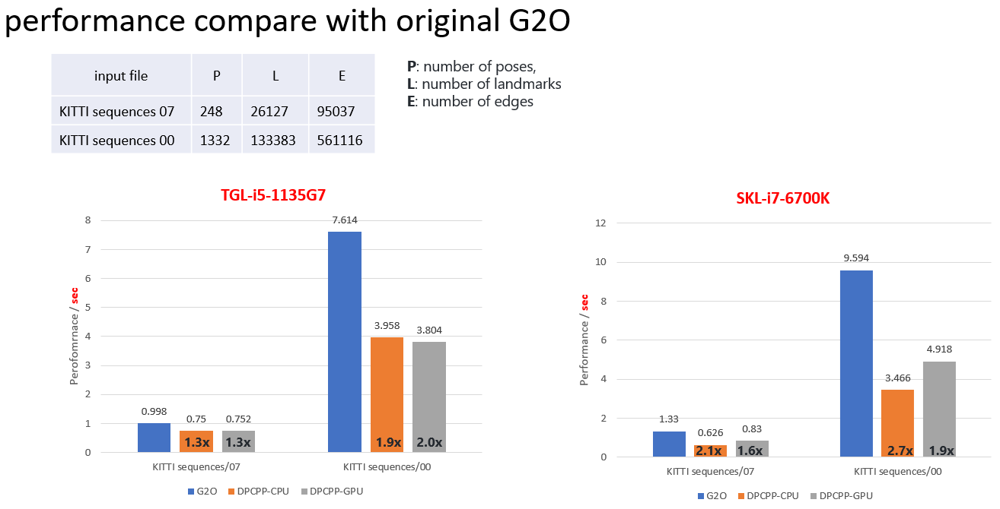

# `dpcpp-bundle-adjustment` Sample

The `dpcpp-bundle-adjustment` sample is Bundle Adjustment used in robotic to jointly optimize the parameters of a 3D scene and the camera parameters that captured the images of that scene, migrated from CUDA implementation, use DPC++ and Intel MKL to handle all computation, verified on Intel CPU and GPU

>**Note**: This sample implementation is migrated and optimized from the [*Fixstars: cuda-bundle-adjustment*](https://github.com/fixstars/cuda-bundle-adjustment) GitHub repository. 

| Area                      | Description
|:---                       |:---
| What you will learn       | How to combine Intel® MKL Library and Intel® oneAPI Base Toolkit (Base Kit) to offload the computation of a complex workload (bundle adjustment) to CPU or GPU
| Time to complete          | 30 minutes
| Category                  | Reference Designs and End to End

## Purpose


## Prerequisites

| Optimized for             | Description
|:---                       |:---
| OS                        | Ubuntu* 22.04
| Hardware                  | Skylake with GEN9 (or newer) <br>  Intel® Iris® X<sup>e</sup> graphics
| Software                  | Eigen (3.4.0 or newer), OpenCV (4.1.0 or newer) and Intel® oneAPI Base Toolkit (2022.2 or newer)

## Set Environment Variables

When working with the command-line interface (CLI), you should configure the oneAPI toolkits using environment variables. Set up your CLI environment by sourcing the `setvars` script every time you open a new terminal window. This practice ensures that your compiler, libraries, and tools are ready for development.

> **Note**: You can use [Modulefiles scripts](https://www.intel.com/content/www/us/en/develop/documentation/oneapi-programming-guide/top/oneapi-development-environment-setup/use-modulefiles-with-linux.html) to set up your development environment. The modulefiles scripts work with all Linux shells.

> **Note**: If you want only specific components or versions of those components, use a [setvars config file](https://www.intel.com/content/www/us/en/develop/documentation/oneapi-programming-guide/top/oneapi-development-environment-setup/use-the-setvars-script-with-linux-or-macos/use-a-config-file-for-setvars-sh-on-linux-or-macos.html) to set up your development environment.


## Build the `dpcpp-bundle-adjustment` Sample

> **Note**: If you have not already done so, set up your CLI
> environment by sourcing  the `setvars` script in the root of your oneAPI installation.
>
> Linux*:
> - For system wide installations: `. /opt/intel/oneapi/setvars.sh`
> - For private installations: ` . ~/intel/oneapi/setvars.sh`
> - For non-POSIX shells, like csh, use the following command: `bash -c 'source <install-dir>/setvars.sh ; exec csh'`
>
> For more information on configuring environment variables, see *[Use the setvars Script with Linux* or macOS*](https://www.intel.com/content/www/us/en/develop/documentation/oneapi-programming-guide/top/oneapi-development-environment-setup/use-the-setvars-script-with-linux-or-macos.html)* or *[Use the setvars Script with Windows*](https://www.intel.com/content/www/us/en/develop/documentation/oneapi-programming-guide/top/oneapi-development-environment-setup/use-the-setvars-script-with-windows.html)*.

### On Linux*

1. Change to the sample directory.
2. Build the program.
   ```
   mkdir -p build
   cd build
   cmake ..
   make
   ```

#### Troubleshooting

If an error occurs, you can get more details by running `make` with
the `VERBOSE=1` argument:
```
make VERBOSE=1
```
If you receive an error message, troubleshoot the problem using the **Diagnostics Utility for Intel® oneAPI Toolkits**. The diagnostic utility provides configuration and system checks to help find missing dependencies, permissions errors, and other issues. See the *[Diagnostics Utility for Intel® oneAPI Toolkits User Guide](https://www.intel.com/content/www/us/en/develop/documentation/diagnostic-utility-user-guide/top.html)* for more information on using the utility.


## Run the `dpcpp-bundle-adjustment` Sample

### On Linux

1. Change to the sample directory.
2. Build the program.
3. Run the program on CPU
    ```
    make run
    ```
3. Run the program on GPU
    ```
    make run_gpu
    ```

## Example Output





## License

Code samples are licensed under the MIT license. See [License.txt](https://github.com/oneapi-src/oneAPI-samples/blob/master/License.txt) for details.

Third-party program Licenses can be found here: [third-party-programs.txt](https://github.com/oneapi-src/oneAPI-samples/blob/master/third-party-programs.txt).